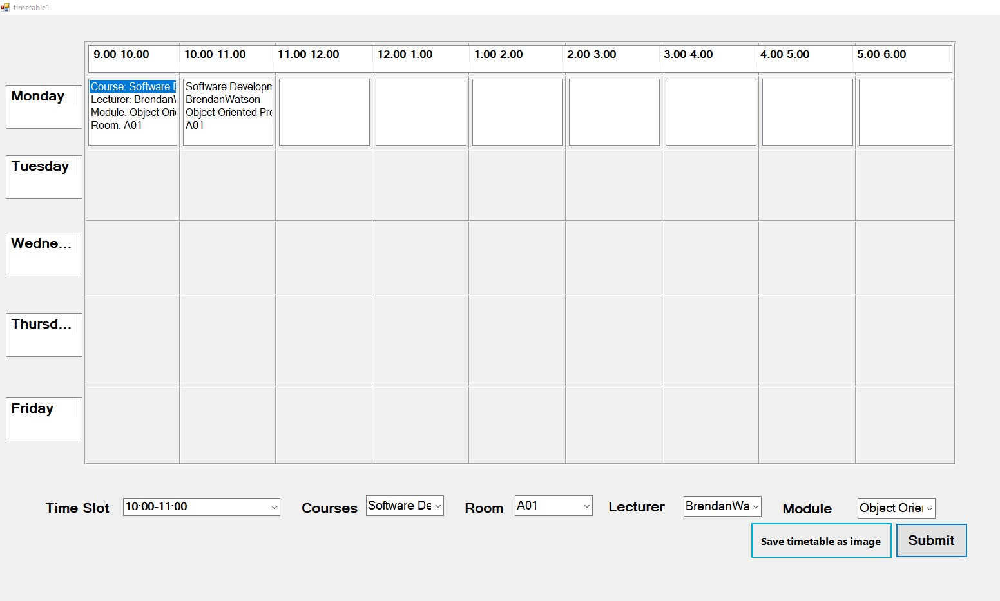
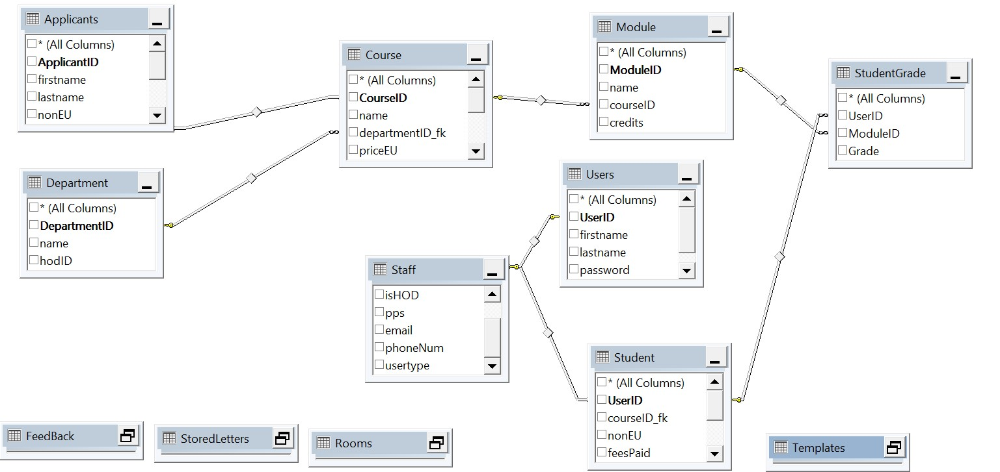

## CaherDavin College ReadMe File with instructions 

When the project is downloaded it will need to be built and cleaned to extract all the packages 
Change the Database connection string , located in the datalayer, 

There is a Bacpac file included with the project and this can be imported into SQL server management 
studio by clicking import data tier application 
This will import any data and tables needed 

The main user account is the SuperAdministrator 
UserName: 101
Password: 123

When logged in as an administrator a selection of tabs will be shown and these can be used to 
navigate to the functions in the project 
The timetable tab contains a button called create timetable and when clicked will load a new 
timetable form
once data is selected in the dropdown lists at the bottom of the form click submit and you will see it populate the lists
Click on save timetable as image this will create a folder in the debug folder called images and will then send
a screenshot image of the timetable to that folder 
An error we recently encountered is may appear where it asks you to retake the screenshot so click it again and it will work 

## Screenshots of Application 

### Timetable With some enteries

### Main Screen showing all option tabs

### Database Diagram

